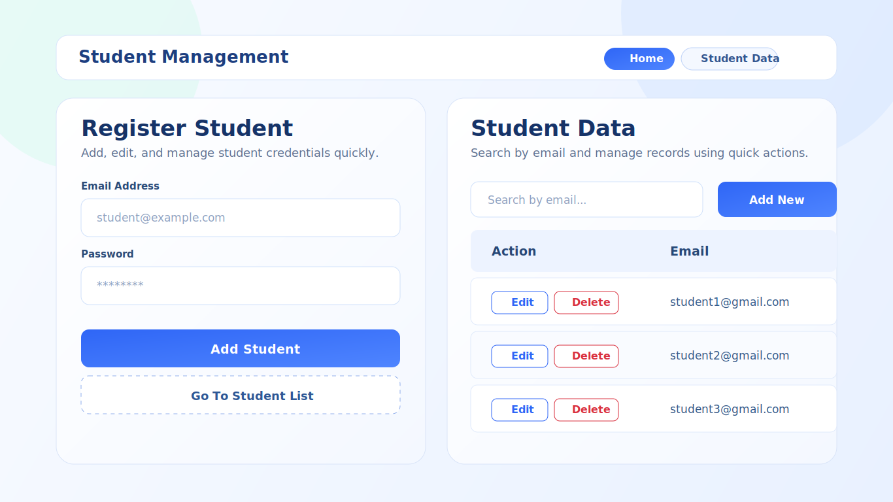

# Student Management App

Modern student CRUD interface built with React + Vite, featuring clean light UI, instant search, toast feedback, and localStorage persistence.

<p align="left">
  
  
  
  
</p>

## Preview



## Key Features

- Add, update, and delete student records
- Search students by email in real-time
- Styled action buttons (`Edit` outline blue, `Delete` outline red)
- Toast popup messages for all major actions
- Route-based navigation (`Home` and `Student Data`)
- Data persistence in browser localStorage (`students`)

## Tech Stack

- React 19
- Vite 7
- React Router DOM 7
- Bootstrap 5
- ESLint 9

## Quick Start

```bash
npm install
npm run dev
```

Open the local URL shown in terminal (usually `http://localhost:5173`).

## Usage Flow

1. Fill in email and password on the Home page.
2. Click `Add Student` to save.
3. Open `Student Data` from navbar.
4. Use search bar to filter by email.
5. Click `Edit` to load a record back into the form.
6. Click `Delete` to remove a record.

## Available Scripts

| Script | Description |
| --- | --- |
| `npm run dev` | Start development server |
| `npm run build` | Create production build |
| `npm run preview` | Preview production build |
| `npm run lint` | Run ESLint checks |

## Project Structure

```text
std-mngt/
  docs/
    screenshots/
      student-management-preview.svg
  public/
  src/
    components/
      AppToast.jsx
      Header.jsx
      Home.jsx
      StdData.jsx
    App.jsx
    index.css
    main.jsx
  package.json
  README.md
```

## Notes

- Frontend-only project (no backend/API yet).
- Current password field is for demo CRUD behavior.
- You can extend this with form validation, auth, and backend integration.
